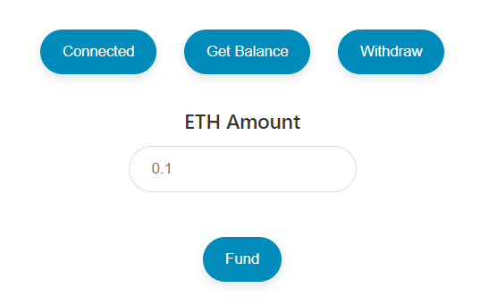

# Fund Me Smart Contract Using Foundry
This project demonstrates a Fund Me smart contract, allowing the owner to deploy a contract to initiate a fundraiser and securely withdraw the raised funds.

## Prerequistes

- **[Foundry Installation](https://book.getfoundry.sh/getting-started/installation)**:
  Foundry is a prerequisite. Install it using the following script -
  ```bash
   curl -L https://foundry.paradigm.xyz | bash
   ```
- **[Metamask](https://chromewebstore.google.com/detail/metamask/nkbihfbeogaeaoehlefnkodbefgpgknn)**
MetaMask is a software cryptocurrency wallet used to interact with the Ethereum blockchain. It allows users to access their Ethereum wallet through a browser extension or mobile app, which can then be used to interact with decentralized applications.

## Getting Things Ready
Execute the ensuing steps to prepare the project environment:

1. **Clone the Repository**:
   Attain your local copy with:
   ```bash
   git clone https://github.com/iamber12/fund-me-smart-contract-using-foundry
   ```

2. **Compile the Project**:
   Build the project using foundry:
   ```bash
   forge build
   ```

## Deployment

### Anvil Local Chain Deployment

- For local testnet emulation, deploy using:
  ```bash
  forge script script/DeployFundMe.s.sol
  ```

### Real-world Testnet/Mainnet Deployment
For this you will need two things as prerequiste - 
    - PRIVATE_KEY: Your metamask account's private key.
    - SEPOLIA_RPC_URL: The URL of the Sepolia testnet node you're using. You can obtain a free setup of one through Alchemy.

#### Initiate Deployment

- Proceed with contract deployment using:
  ```bash
  forge script script/DeployFundMe.s.sol --rpc-url $SEPOLIA_RPC_URL --private-key $PRIVATE_KEY --broadcast
  ```

## Testing
We mainly focus on unit and integration test in this project.
### Running all the tests

- In order to run all the tests, use the following command:
  ```bash
  forge test
  ```

### Running a specific test

- In order to run a specific test, use the following command:
  ```bash
  forge test --mt <function_name>
  ```

### Fork-based Sepolia Testnet Analysis

- To conduct tests on a Sepolia network fork, use:
  ```bash
  forge test --fork-url $SEPOLIA_RPC_URL
  ```

- For an overview of test coverage, execute:
  ```bash
  forge coverage
  ```

## Gas Usage Synopsis

- To get an overview of the gas usage, use the following command:
  ```bash
  forge snapshot
  ```

## Implementing UI
An application of this smart contract would look something like this-




Thanks to [Cyfrin](https://www.cyfrin.io/). You can find one such implementation in this [repo](https://github.com/Cyfrin/html-fund-me-f23).
